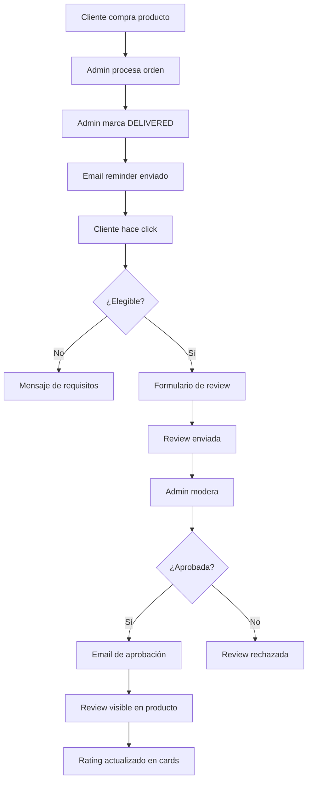

# 🌟 Sistema de Reviews y Notificaciones - ElectroWeb

## Descripción General

Sistema completo de reseñas de productos con validación de compra verificada, moderación administrativa, notificaciones por email y panel de cliente.

---

## 🎯 Características Principales

### Para Clientes
- ✅ Dejar reseñas solo de productos comprados y entregados
- ✅ Ver historial de reseñas propias
- ✅ Recibir notificaciones cuando review es aprobada
- ✅ Ver reviews de otros clientes en productos
- ✅ Badge de "Compra verificada"

### Para Administradores
- ✅ Panel de moderación de reviews
- ✅ Aprobar/Rechazar/Eliminar reviews
- ✅ Filtros por estado
- ✅ Widget de reviews recientes en dashboard
- ✅ Estadísticas de reviews

### Sistema de Emails
- ✅ Email reminder después de entrega
- ✅ Email de confirmación cuando review es aprobada
- ✅ Templates profesionales sin emojis
- ✅ Responsive y compatible con todos los clientes

---

## 📁 Estructura de Archivos

```
app/
├── api/
│   └── reviews/
│       ├── route.ts                    # CRUD de reviews
│       └── check-eligibility/route.ts  # Validación de elegibilidad
├── admin/(dashboard)/
│   └── reviews/page.tsx                # Panel de moderación
└── customer/(dashboard)/
    ├── orders/page.tsx                 # Con OrderTracking
    └── reviews/page.tsx                # Mis Reseñas

components/
├── reviews/
│   ├── StarRating.tsx                  # Componente de estrellas
│   ├── ReviewForm.tsx                  # Formulario con validación
│   ├── ReviewList.tsx                  # Lista de reviews
│   └── ReviewStats.tsx                 # Estadísticas
├── orders/
│   └── OrderTracking.tsx               # Rastreo épico
├── admin/
│   └── ReviewsWidget.tsx               # Widget para dashboard
└── ui/
    ├── ProductCard.tsx                 # Con rating display
    ├── FadeIn.tsx                      # Animaciones
    └── Button.tsx                      # Enhanced

lib/
├── reviews.ts                          # Helper functions
└── email-templates/
    ├── base.ts                         # Base system
    ├── OrderConfirmation.ts
    ├── ReviewReminder.ts
    └── ReviewApproved.ts
```

---

## 🚀 Instalación y Configuración

### 1. Variables de Entorno

```env
# Database
DATABASE_URL="postgresql://..."

# SMTP Configuration
SMTP_HOST=smtp.gmail.com
SMTP_PORT=587
SMTP_SECURE=false
SMTP_USER=your-email@gmail.com
SMTP_PASS=your-app-password
SMTP_FROM_NAME=Your Company
SMTP_FROM_EMAIL=noreply@yourcompany.com

# App URL
NEXTAUTH_URL=https://yourdomain.com
```

### 2. Migración de Base de Datos

El modelo `Review` ya existe en el schema de Prisma:

```prisma
model Review {
  id                 String   @id @default(cuid())
  productId          String
  userId             String
  userName           String
  userImage          String?
  rating             Int
  title              String?
  comment            String
  images             String[]
  isVerifiedPurchase Boolean  @default(false)
  isApproved         Boolean  @default(false)
  isPublished        Boolean  @default(false)
  createdAt          DateTime @default(now())
  updatedAt          DateTime @updatedAt

  product Product @relation(fields: [productId], references: [id])
  user    User    @relation(fields: [userId], references: [id])
}
```

### 3. Configurar SMTP (Gmail)

1. Habilita verificación en 2 pasos en tu cuenta Google
2. Ve a: https://myaccount.google.com/apppasswords
3. Genera una contraseña de aplicación
4. Usa esa contraseña en `SMTP_PASS`

---

## 💻 Uso del Sistema

### API Endpoints

#### GET /api/reviews
Obtener reviews de un producto o usuario

```typescript
// Reviews de un producto
const response = await fetch('/api/reviews?productId=123&publishedOnly=true');
const { reviews, stats } = await response.json();

// Reviews de un usuario
const response = await fetch('/api/reviews?userId=456');
const reviews = await response.json();
```

#### POST /api/reviews
Crear una nueva review (requiere autenticación)

```typescript
const response = await fetch('/api/reviews', {
  method: 'POST',
  headers: { 'Content-Type': 'application/json' },
  body: JSON.stringify({
    productId: '123',
    rating: 5,
    title: 'Excelente producto',
    comment: 'Muy buena calidad...',
  }),
});
```

#### PATCH /api/reviews
Actualizar review (usuarios: contenido, admins: aprobación)

```typescript
// Admin aprueba review
const response = await fetch('/api/reviews', {
  method: 'PATCH',
  headers: { 'Content-Type': 'application/json' },
  body: JSON.stringify({
    id: 'review-id',
    isApproved: true,
    isPublished: true,
  }),
});
```

#### GET /api/reviews/check-eligibility
Verificar si usuario puede dejar review

```typescript
const response = await fetch('/api/reviews/check-eligibility?productId=123');
const { canReview, message } = await response.json();
```

### Componentes

#### ReviewForm
```tsx
import ReviewForm from '@/components/reviews/ReviewForm';

<ReviewForm 
  productId="product-id" 
  onReviewSubmitted={() => refetchReviews()} 
/>
```

#### ReviewList
```tsx
import ReviewList from '@/components/reviews/ReviewList';

<ReviewList reviews={reviews} />
```

#### ReviewStats
```tsx
import ReviewStats from '@/components/reviews/ReviewStats';

<ReviewStats 
  averageRating={4.5} 
  totalReviews={120}
  distribution={{ 5: 80, 4: 30, 3: 8, 2: 1, 1: 1 }}
/>
```

#### OrderTracking
```tsx
import OrderTracking from '@/components/orders/OrderTracking';

<OrderTracking
  status="SHIPPED"
  createdAt="2024-01-01T00:00:00Z"
  paidAt="2024-01-01T01:00:00Z"
  shippedAt="2024-01-02T00:00:00Z"
  deliveredAt={null}
  deliveryMethod="HOME_DELIVERY"
/>
```

### Helper Functions

```typescript
import { 
  getProductReviewStats,
  canUserReviewProduct,
  getReviewStatistics 
} from '@/lib/reviews';

// Obtener stats de un producto
const stats = await getProductReviewStats('product-id');
// { averageRating: 4.5, totalReviews: 120 }

// Verificar elegibilidad
const eligibility = await canUserReviewProduct('user-id', 'product-id');
// { canReview: true, deliveredAt: Date }

// Stats para admin
const adminStats = await getReviewStatistics();
// { total, pending, approved, recentReviews, ... }
```

---

## 🔄 Flujos de Trabajo

### Flujo Completo de Review



### Flujo de Emails

```
1. Orden creada → OrderConfirmation
2. Orden DELIVERED → ReviewReminder
3. Review aprobada → ReviewApproved
```

---

## 🎨 Personalización

### Cambiar Colores del Sistema

Edita los archivos de componentes y busca las clases de Tailwind:

```tsx
// Cambiar color principal (azul)
'bg-[#2a63cd]' → 'bg-[#tu-color]'
'text-[#2a63cd]' → 'text-[#tu-color]'
```

### Personalizar Email Templates

Edita `lib/email-templates/base.ts`:

```typescript
export function getEmailStyles() {
  return `
    <style>
      .button {
        background: linear-gradient(135deg, #TU-COLOR 0%, #TU-COLOR-DARK 100%);
      }
    </style>
  `;
}
```

### Modificar Validaciones

Edita `app/api/reviews/check-eligibility/route.ts` para cambiar requisitos.

---

## 📊 Métricas y Analytics

### Tracking de Reviews

```typescript
// En tu analytics
analytics.track('Review Submitted', {
  productId,
  rating,
  isVerifiedPurchase: true,
});

analytics.track('Review Approved', {
  reviewId,
  rating,
});
```

### KPIs Importantes

- **Tasa de conversión a review**: Órdenes DELIVERED / Reviews enviadas
- **Rating promedio**: Por producto y global
- **Tiempo de moderación**: Creación → Aprobación
- **Reviews verificadas**: % de reviews con compra verificada

---

## 🐛 Troubleshooting

### Reviews no aparecen en producto

**Causa**: Reviews no aprobadas  
**Solución**: Ir a `/admin/reviews` y aprobar

### Email no se envía

**Causa**: Configuración SMTP incorrecta  
**Solución**: 
1. Verificar variables de entorno
2. Revisar logs del servidor
3. Probar con Gmail App Password

### No puedo dejar review

**Causa**: No cumple requisitos  
**Solución**: Verificar que:
- Estés autenticado
- Hayas comprado el producto
- Tu pedido esté DELIVERED

### Rating no actualiza en cards

**Causa**: Cache o query incorrecta  
**Solución**: Asegúrate de incluir `averageRating` y `totalReviews` en tu query

---

## 🔒 Seguridad

### Validaciones Implementadas

- ✅ Autenticación requerida para crear reviews
- ✅ Solo 1 review por producto por usuario
- ✅ Solo productos comprados y entregados
- ✅ Permisos de admin para moderación
- ✅ Sanitización de inputs
- ✅ Rate limiting (recomendado agregar)

### Mejores Prácticas

1. **Nunca** confíes en datos del cliente
2. **Siempre** valida en el servidor
3. **Usa** prepared statements (Prisma lo hace)
4. **Implementa** rate limiting para APIs
5. **Monitorea** intentos de spam

---

## 📈 Roadmap Futuro

### Próximas Features Sugeridas

- [ ] Imágenes en reviews (schema ya listo)
- [ ] Respuestas de vendedor a reviews
- [ ] Votos útiles en reviews
- [ ] Filtros avanzados (con imágenes, verificadas, etc.)
- [ ] Notificaciones push
- [ ] Analytics dashboard
- [ ] Exportar reviews a CSV
- [ ] Moderación automática con IA

---

## 📝 Changelog

### v1.0.0 (2024-01-23)
- ✅ Sistema completo de reviews
- ✅ Validación de compra verificada
- ✅ Panel de moderación admin
- ✅ 6 email templates
- ✅ OrderTracking épico
- ✅ Rating en product cards
- ✅ Página "Mis Reseñas"
- ✅ Widget de reviews para dashboard

---

## 🤝 Contribuir

Para contribuir al sistema:

1. Crea una rama feature
2. Implementa tu mejora
3. Agrega tests
4. Actualiza documentación
5. Crea PR

---

## 📞 Soporte

Para dudas o problemas:
- Revisa esta documentación
- Consulta `GUIA_DE_USO.md`
- Revisa el código en los archivos mencionados

---

**Desarrollado con ❤️ para ElectroWeb**  
**Versión**: 1.0.0  
**Última actualización**: 2024-01-23
